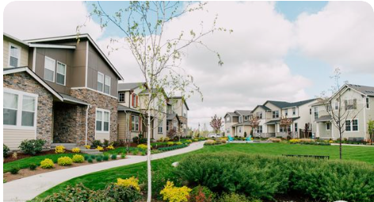

  

 
<h1 style="font-size: 18px;">RenoStrategix: Transforming Homes, Elevating Values</h1>
     
### Authors

• Caroline Njeri.  
• Amadi Growman.  
• Lynns Waswa.   
• Robert Gesembe.   
• David Kirianja.   
• James Nyamu.   

<h2 style="font-size: 18px;">Business Overview:</h2>

Welcome to RenoStrategix, where the world of real estate meets the art and science of optimizing home renovations for increased property value. In this project, we address a real-world problem faced by our visionary real estate agency known as "CasaCrafters Realty Solutions." CasaCrafters aims to revolutionize the way homeowners approach renovations by providing data-driven advice on how specific home improvements impact property values. The primary challenge is to assist homeowners in making informed decisions about renovations that yield the highest return on investment. To achieve this objective, we will use multiple linear regression modeling to analyze house sales data in the King County area. Our focus is not just on increasing value but also on enhancing the overall appeal for potential buyers

<h2 style="font-size: 18px;">Business Problem</h2>
 
Homeowners often find themselves at a crossroads when deciding on renovations. The lack of clear guidance on which improvements will significantly enhance their property values becomes a real-world challenge. CasaCrafters seeks to bridge this gap by offering tailored advice based on a comprehensive analysis of the King County real estate market.

In the vibrant landscape of King County, CasaCrafters endeavors to create a narrative that extends beyond buying and selling homes. Imagine a homeowner named Alex, who dreams of transforming their house into a haven. However, Alex is uncertain about which renovations will not only fulfill personal desires but also enhance the property's market value.

Through the journey of Alex's home transformation, CasaCrafters navigates the complex realm of real estate, uncovering insights that go beyond the expected. The story unfolds as Alex learns about the potential return on investment for various renovations, transforming not just the home but the overall real estate experience.

### Objective 1: Identify Key Features Impacting Property Values

**Objective:** Develop a multiple linear regression model to identify and quantify the influence of various features (e.g., square footage, number of bedrooms, location) on the sale prices of houses in King County.

**Rationale:** Understanding the key features that significantly affect property values is crucial for providing targeted recommendations to homeowners. By analyzing historical sales data, the model will reveal which features have the most substantial impact on sale prices. This information will empower CasaCrafters to guide homeowners on prioritizing renovations that are likely to yield the highest returns.

### Objective 2: Build a Predictive Model for Property Valuation

**Objective:** Construct a robust multiple linear regression model that accurately predicts house sale prices based on selected features, allowing for personalized property valuation.

**Rationale:**  The predictive model will serve as a valuable tool for CasaCrafters to estimate the potential impact of specific renovations on a property's value. By inputting proposed changes into the model, homeowners can receive personalized predictions of how these renovations might affect the sale price. This enables informed decision-making and helps homeowners focus on improvements that align with their goals while maximizing return on investment.

### Objective 3: Provide Renovation Recommendations for Maximum ROI

**Objective:** Utilize the developed multiple linear regression model to generate personalized recommendations for homeowners, suggesting specific renovations that are predicted to have the highest positive impact on property values.

**Rationale:** CasaCrafters aims to be a trusted advisor for homeowners seeking to enhance their properties. By leveraging the regression model's insights, the agency can offer tailored recommendations, outlining the renovations that are not only aligned with the homeowner's vision but also expected to yield the greatest return on investment. This proactive approach adds significant value to CasaCrafters' services, fostering trust and satisfaction among homeowners.

<h2 style="font-size: 18px;">Data Pre-Processing</h2>

The first task to read the data file into our working environment then explore it to gain an initial understanding of the dataset. Moreover, this step also allows us to determine what data wrangling techniques to apply in order to transform the data into a form that can be analysed and modeled.

<h2 style="font-size: 18px;">Exploratory data analysis</h2>

This involved the following activities;

• Checking the shape of the dataset.  
• Inspecting the properties of the dataset.  
• Understanding the description of the dataset.   
• Sampling the 1st 5 rows of the dataset.   

<h2 style="font-size: 18px;">Data Cleaning</h2>

We first checked for the total number of null values under all the columns. This allowed us to identify which values to replace considering the percentage of the missing value in comparison to the length of the respective columns and to come up with assumptions before replacing the missing values. Only 4 columns had missing values based on our assessment. We replaced the missing values under waterfront with a "NO" with an assumption that that the datapoints where there was a NaN value represented houses that lacked a waterfront.

We also replaced the missing values in the year renovated with the respective values in the year built taking into account an assumption that the houses that are missing values in the column year renovated have never been renovated since they were built. The basement column had "?" that represented missing information and for this we replaced them with a no with an assumption that these houses have no basements.

After replacing the missing values we checked again for missing values to verify that all the missing values were taken care of. We also created a new column(years_since_renovation) from the difference in the number of years between year_built and year_renovated to get the number of years it took for the respective houses to be renovated. 

We then checked for the data type for all the columns in the data frame and changed 'year_built','year_renovated'and 'Years_Since_Renovation' to integer values and changed the date column data type to datetime

<h2 style="font-size: 18px;">Outlier Detection</h2>

We check for outliers in the price column using inter quartile range method and plotted a boxplot method. We iassessed that the Number of outliers in the price column are 1153 with Lower bound for outliers being -162500.0 and the Upper bound being 1129500.0.

  

<h2 style="font-size: 18px;">Categorical Variables</h2>

These are that variables that represent categories or groups. Unlike numerical variables, which can take on numerical values with a meaningful order, categorical variables consist of discrete categories or labels in this case they were represented in the 'waterfront', 'view', 'condition', and 'grade' columns. Below are some of the visuals of the categorical data

  

<h2 style="font-size: 18px;">Feature Selection</h2> 

#### Identifying the most influential features through analysis and correlation.

Using Pearson correlation in pandas, we obtained the correlation matrix for all the numerical columns in the dataset. Below is a representation of the correlation in the correlation matrix;

  

<h2 style="font-size: 18px;">Model Building</h2>

#### Train a multiple linear regression model using the selected features.

Base on our intuition we selected the most influential features as identified from the correlation analysis. there were

• 'sqft_living'   
• 'sqft_above'  
• 'sqft_living15'   
• 'bathrooms'  
• 'grade_11 Excellent'  
• 'view_NONE'  
• 'grade_10 Very Good'  
• 'grade_7 Average'  
• 'bedrooms'  

We split the data into training and testing sets then trained the multiple linear regression model and tested by Predicting the test results. Lastly we calculated and displayed the performance test matrix(MSE and R-Squared )

Our  Mean Squared Error (MSE) is 58286402686.6614 and it provides the measure of the average squared difference between the predicted and actual prices in the test set. Our R-squared is 0.5523877457112082 indicating the proportion of variance in house prices that can be explained by the selected features. **NOTE**;An R-squared value closer to 1 suggests a better fit of the model to the data. Below is the scatter plot of the predicted and the actual values

  

<h2 style="font-size: 18px;">Model Evaluation</h2>

#### Assessing the performance of the model and interpreting the coefficients

We used the mean squared Error to assess the model. This metric (MSE) measures the average absolute difference between the predicted and actual values. It provides a measure of the average magnitude of errors in the model's predictions. Below is the visual representation of the model coefficients

  

Coefficients: The coefficients represent the weights assigned to each feature in the linear regression model. Positive coefficients indicate a positive correlation with the target variable, while negative coefficients indicate a negative correlation. The intercept represents the estimated value of the target variable when all features are zero.

<h2 style="font-size: 18px;">Recommendation System</h2>

#### Developing a system to recommend specific renovations based on their predicted impact on house prices

We Identified features that can be changed through renovations and their coefficients and created a data frame provides insights into the linear regression model's predictions regarding how changes in certain features related to renovations might impact the house price. The coefficients represent the estimated change in the price for a one-unit increase in each respective feature

The image below shows how the respective features are important

  

• Sqft_living has the highest importance score, indicating that changes in living area square footage are most likely to impact the house price.    
• Sqft_above, the square footage above the ground level, has a smaller importance score.      
• Bathrooms have an extremely low importance score, suggesting that they have a negligible impact on the house price within this model.

Based on these results, a recommendation system for renovations could prioritize increasing the living area square footage (sqft_living) as it is likely to yield the highest return on investment in terms of increasing house prices. The bar chart clearly shows the relative importance of each feature, with sqft_living standing out as the most influential factor for house price predictions in this model

<h2 style="font-size: 18px;">Recommendation and conclusions</h2>

Based on the model insights, here is clear and actionable advice for homeowners considering renovations to increase their house's value:

• **Maximize Living Space:** Expanding the living space is a key strategy for maximizing the house's value. Consider options like room additions, finishing basements, or creating open floor plans.

• **Strategic Bathroom Additions:** Strategically adding bathrooms can be a valuable investment. Evaluate the existing layout and identify spaces where an additional bathroom could enhance convenience and appeal.

• **Grade Upgrades:** Upgrading the house grade, especially to 'Excellent,' can significantly increase the property's market value. Explore ways to enhance the quality of materials and finishes in your home.

• **Avoid Downgrades:** Downgrading to an 'Average' grade is associated with a predicted decrease in house price. Prioritize renovations that elevate or maintain the current grade.

• **Continuous Monitoring:** Regularly monitor real estate trends and revisit your property's value estimation. Housing markets evolve, and periodic assessments help in making informed decisions about future renovations or selling strategies.

<h2 style="font-size: 18px;">Next Steps</h2>

• **Consult with Professionals:** Engage with local real estate professionals and renovation experts to get personalized advice based on the specific real estate market and property conditions in your area.

• **Budget Considerations:** Evaluate the potential return on investment for each suggested renovation in relation to your budget. Prioritize renovations that align with your financial capacity and long-term goals.

• **Local Market Dynamics:** Understand the dynamics of the local real estate market. Market conditions, neighborhood trends, and buyer preferences can influence the impact of renovations on property value.

• **Quality Over Quantity:** Focus on quality renovations rather than sheer quantity. Strategic improvements that enhance functionality and aesthetics are likely to yield better returns.

• **Holistic Approach:** Consider a holistic approach to renovations. While specific features like square footage and bathrooms are impactful, the overall appeal of the property, including curb appeal and energy efficiency, also contributes to its market value.

<h1 style="font-size: 18px;">Group 6 Contact Information</h1>

Name: Amadi Growman

Email:amadi.growman@student.moringaschool.com

Name: Caroline Njeri.  

Email:caroline.njoroge@student.moringaschool.com

Name:Lynns Waswa.   

Email:lynns.waswa@student.moringaschool.com

Name: Robert Gesembe.   

Email:robert.gesembe@student.moringaschool.com

Name: David Kirianja.   

Email:david.kiranja@student.moringaschool.com

Name: James Nyamu.

Email:james.nyamu@student.moringaschool.com
